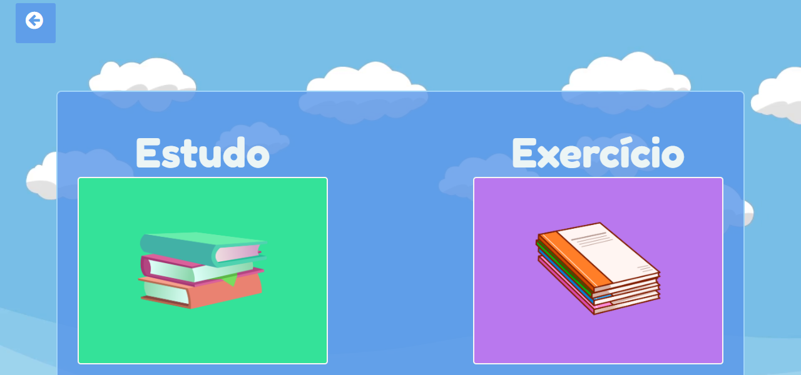
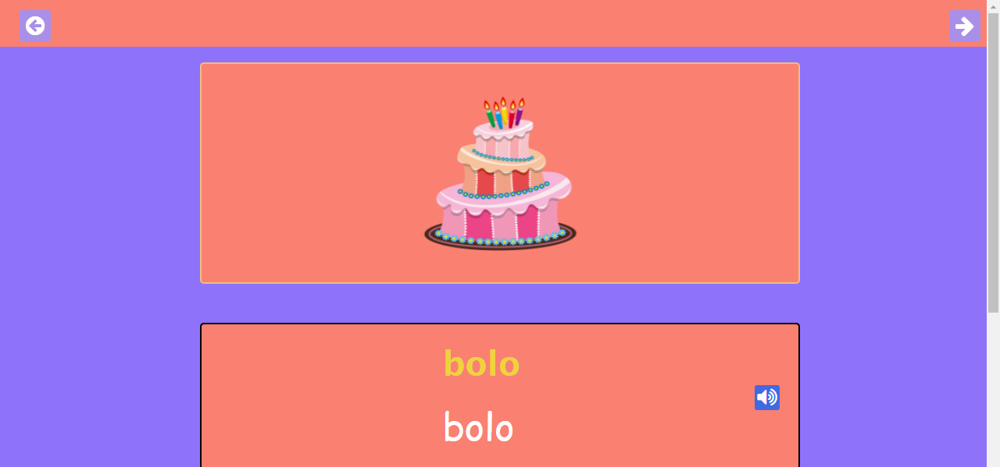
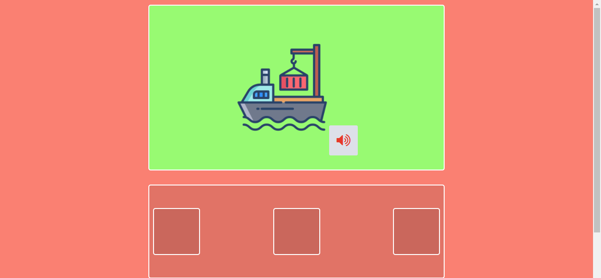
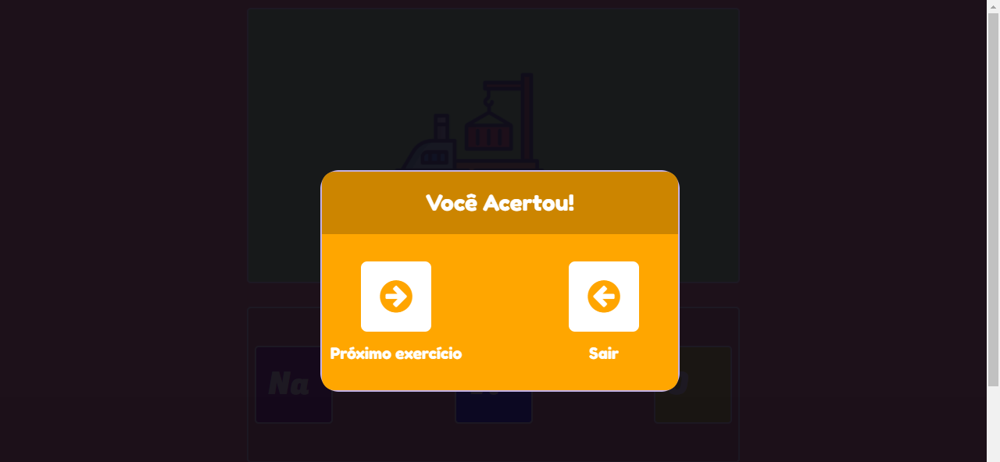

# Ver-o-Texto
Application built to help students from elementary school in literacy.

# Motivation
Brazilian education system has a huge deficiency, which frequently lies on literacy process. Thus, the project was done
to help students and teachers to overcome those difficulties, with technology's help.

# Screenshots

# Tech used
* Javascript
* Html
* Node.js
   
Built with
* Nw.js

